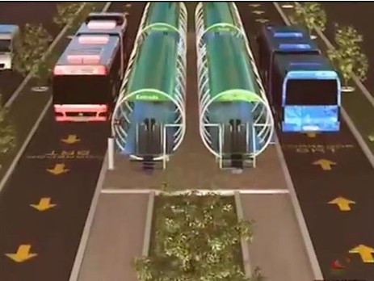
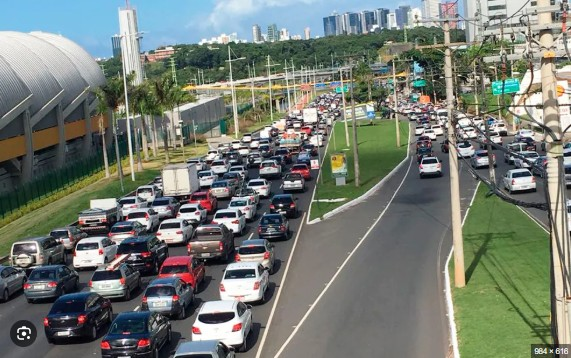
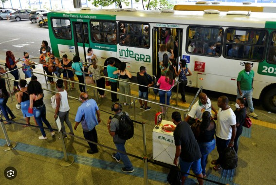
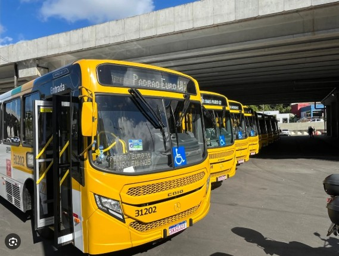

# Galeria científica

Esta galeria apresenta os principais produtos visuais desenvolvidos nos notebooks da disciplina **PPEC0039 – Estatística e Planejamento de Experimentos**.

::: {.scientific-gallery}

::: {.gallery-item}

<h3>Aula 03 — Testes de Hipóteses</h3>

Aplicação de teste estatístico para avaliar o tempo médio de deslocamento em uma rede de transporte.

<a href="https://github.com/Vbrandao13/ppec-0039-estatistica-aplicada/blob/main/aulas/aula-03/codigos/aula-03.ipynb.ipynb" target="_blank" class="btn-github">Ver notebook</a>

:::

::: {.gallery-item}

<h3>Aula 04 — Distribuição Normal</h3>

Representação da curva normal aplicada à análise da variabilidade dos tempos de viagem.

<a href="https://github.com/Vbrandao13/ppec-0039-estatistica-aplicada/blob/main/aulas/aula-04/c%C3%B3digos/tempo_viagem_distribuicao_normal_grafico.ipynb" target="_blank" class="btn-github">Ver notebook</a>

:::

::: {.gallery-item}

<h3>Aula 09 — Amostragem</h3>

Comparação entre população, amostra aleatória simples e amostragem estratificada no transporte público.

<a href="https://github.com/Vbrandao13/ppec-0039-estatistica-aplicada/blob/main/aulas/aula-09/c%C3%B3digos/amostragem_transporte_publico.ipynb" target="_blank" class="btn-github">Ver notebook</a>

:::

::: {.gallery-item}

<h3>Aula 14 — ANOVA</h3>

Aplicação da análise de variância para comparação estatística entre grupos.

<a href="https://github.com/Vbrandao13/ppec-0039-estatistica-aplicada/blob/main/aulas/aula-14/codigos/aula-14.ipynb" target="_blank" class="btn-github">Ver notebook</a>

:::

:::